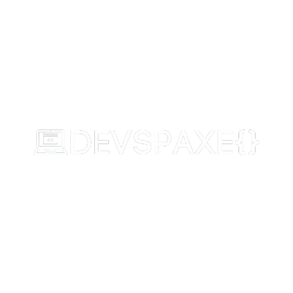

<div align="center">

  

  # DEVSPAXE
  **The Next-Generation Interactive Workspace & Polyglot IDE for Developers**

  [](https://reactjs.org/)
  [](https://vitejs.dev/)
  [](https://nodejs.org/)
  [](https://www.docker.com/)
  [](https://supabase.com/)
  [](LICENSE)

  *Combine rich block-based notes, interactive data structure visualizers, linked HTML/CSS sandboxes, learning roadmaps, and secure multi-language code execution in a single unified workspace.*

  [Features](#-key-features) • [Architecture](#-system-architecture) • [Tech Stack](#-tech-stack) • [Getting Started](#-getting-started) • [Deployment](#-deployment-guide) • [Security](#-security--sandboxing)

</div>

---

## 🌟 Overview

**DEVSPAXE** is an all-in-one developer notebook, polyglot playground, and algorithm visualization environment. Designed for computer science students, software engineers, and technical educators, DEVSPAXE bridges the gap between theoretical note-taking and hands-on code execution.

Whether you're compiling **C++17**, running **Python 3**, testing **Java 17** single-file scripts, live-previewing **HTML/CSS**, or step-executing **pseudocode with visual data structures**, DEVSPAXE processes your code safely and instantly.

---

## ⚡ Key Features

### 🚀 Polyglot Code Execution Engine
* **Server-Side Sandbox**: Dockerized container running native `g++` (C++17), `python3`, and `default-jdk` (Java 17).
* **Client-Side JS Runner**: Zero-latency, secure in-browser JavaScript execution via sandboxed HTML5 `iframe`.
* **Live HTML/CSS Web Projects**: Pair separate HTML and CSS blocks with real-time browser frame rendering and pop-out preview support.
* **Pseudocode Runner**: Custom step-by-step engine to trace variables, stack calls, and algorithmic logic.

### 🛡️ Concurrency Queue & Rate Limiting
* **Concurrency Pool**: Built-in async execution queue (`MAX_CONCURRENT = 3`) to safeguard backend resources under load.
* **Abuse Protection**: Integrated IP rate-limiting (10 runs/min), payload size guards (50k chars max), and strict execution timeouts (8s hard limit).

### 📊 Interactive Algorithm & Data Structure Blocks
* **9 Interactive Visualization Templates**: Stack, Queue, Array, Linked List, Binary Tree, Graph, Sliding Window, Two Pointers, and Min/Max Heap.
* **Step-by-Step State Tracing**: Observe data structure mutations live as you step through code.

### 🗺️ Visual Learning Roadmaps
* **Node-Based Canvas**: Drag-and-drop interactive roadmap canvas powered by React Flow.
* **Notebook Integration**: Link nodes directly to specific notes, subjects, or learning paths.

### 👥 Real-Time Collaboration & Granular Privacy
* **Public & Private Notes**: Toggle individual note privacy with public link generation.
* **Collaborator Management**: Invite team members with Editor or Viewer roles enforced via Supabase Row-Level Security (RLS).

### 🎨 State-of-the-Art Aesthetic & UX
* **Monaco Code Editor**: Powered by VS Code's editor engine with syntax highlighting, custom dark themes, and autocomplete.
* **Full-Text Global Search**: Instant indexing across note titles, block contents, subjects, and roadmaps.

---

## 🏗️ System Architecture

```
                               ┌────────────────────────────────────────┐
                               │             Client (Browser)           │
                               │  React 18 + Vite + Monaco Editor       │
                               └──────────────────┬─────────────────────┘
                                                  │
                      ┌───────────────────────────┴───────────────────────────┐
                      │                                                       │
                      ▼                                                       ▼
       ┌──────────────────────────────┐                       ┌──────────────────────────────┐
       │   Supabase Cloud Platform    │                       │  DEVSPAXE Docker Backend     │
       │  - PostgreSQL Database       │                       │  - Node.js + Express Server  │
       │  - Authentication (JWT)      │                       │  - Async Queue (Max 3 jobs)  │
       │  - Row-Level Security (RLS)  │                       │  - Rate Limiter (10 req/min) │
       └──────────────────────────────┘                       └──────────────┬───────────────┘
                                                                             │
                                                                             ▼
                                                              ┌──────────────────────────────┐
                                                              │   Containerized Runtimes     │
                                                              │  - g++ (C++17)               │
                                                              │  - python3 (Python 3.11)     │
                                                              │  - default-jdk (Java 17)     │
                                                              └──────────────────────────────┘
```

---

## 🛠️ Tech Stack

### **Frontend**
* **Framework**: React 18, Vite
* **Styling**: Tailwind CSS, Vanilla CSS Design System
* **Code Editor**: `@monaco-editor/react` (VS Code Editor Engine)
* **Roadmap Canvas**: `@xyflow/react` (React Flow)
* **Icons & Animation**: `lucide-react`, `framer-motion`
* **Client Client**: `@supabase/supabase-js`

### **Backend**
* **Runtime**: Node.js (v20 Bookworm Slim)
* **Web Server**: Express 5
* **Security & Limiting**: `express-rate-limit`, `cors`
* **Process Execution**: `child_process.execFile` (No shell injection)
* **Containerization**: Docker (Debian 12 Bookworm)

### **Database & Security**
* **Database**: Supabase PostgreSQL
* **Auth**: Supabase Auth (Publishable Key API)
* **Isolation**: PostgreSQL Row Level Security (RLS) Policies

---

## 📦 Project Structure

```
DEVSPAXE/
├── client/                     # React Frontend Application
│   ├── public/                 # Static assets & brand logos
│   ├── src/
│   │   ├── components/         # CodeBlock, DiagramBlock, RoadmapView, Sidebar, etc.
│   │   ├── lib/                # api.js, codeRunner.js, supabase.js
│   │   ├── pages/              # Auth.jsx, Dashboard.jsx, PublicNote.jsx
│   │   ├── App.jsx             # Main router & layout
│   │   └── main.jsx            # Entry point
│   ├── .env.example            # Client environment template
│   └── vite.config.js          # Vite config with SharedArrayBuffer headers
├── server/                     # Express & Docker Backend Engine
│   ├── Dockerfile              # Debian Bookworm container setup (g++, python3, java)
│   ├── index.js                # Queue, Rate limiter, execFile runners
│   └── package.json            # Server dependencies
├── supabase/                   # Database Migrations & Schemas
│   ├── schema.sql              # Core schema & RLS rules
│   └── add_collaborators.sql   # Collaborator system migration
└── deployment_guide.md         # Production deployment manual (Vercel + Render)
```

---

## ⚡ Getting Started

### Prerequisites
* **Node.js**: v18.x or v20.x
* **Docker Desktop**: (Optional, only required if running backend locally via Docker)
* **Supabase Account**: Free project at [supabase.com](https://supabase.com)

---

### 1. Database Setup

1. Log in to [Supabase](https://supabase.com) and create a new project.
2. Open the **SQL Editor** in your Supabase dashboard.
3. Run the SQL scripts in order:
   * First, execute `supabase/schema.sql`.
   * Second, execute `supabase/add_collaborators.sql`.

---

### 2. Environment Configuration

Copy `.env.example` inside `client/`:
```bash
cp client/.env.example client/.env
```

Update `client/.env`:
```env
VITE_SUPABASE_URL=https://your-project.supabase.co
VITE_SUPABASE_ANON_KEY=your-supabase-publishable-key
VITE_API_URL=http://localhost:5001/api
```

---

### 3. Install & Run Locally

#### **Backend Server** (Terminal 1)
```bash
cd server
npm install
node index.js
```
*Server runs on `http://localhost:5001`*

#### **Frontend App** (Terminal 2)
```bash
cd client
npm install
npm run dev
```
*App runs on `http://localhost:5173`*

---

## 🔒 Security & Sandboxing

DEVSPAXE places security first:

1. **Zero Shell String Injection**: All binary executions use `execFile` with explicit argument arrays instead of shell command strings (`exec`).
2. **Memory & Payload Protection**: Hard-capped request payload limits (50KB max per execution) prevent memory spike attacks.
3. **Automated Rate Limiting**: Max 10 code runs per minute per IP address on execution routes.
4. **Isolated Processing Queue**: Maximum 3 concurrent code execution jobs permitted simultaneously to prevent CPU starvation on host instances.
5. **Sandboxed Web Execution**: Browser JavaScript and HTML/CSS previews execute inside sandboxed `<iframe>` instances with `Cross-Origin-Embedder-Policy: credentialless`.

---

## 🚀 Production Deployment

Refer to our complete [Deployment Guide](deployment_guide.md) for step-by-step instructions on:
* Deploying the Backend Docker image to **Render** (Free Web Service tier).
* Deploying the Frontend React app to **Vercel**.
* Configuring 24/7 keep-awake monitors via **UptimeRobot**.

---

## 📄 License

Distributed under the MIT License. See `LICENSE` for more information.

---

<div align="center">
  <sub>Built with ❤️ for developers by the DEVSPAXE Team.</sub>
</div>
